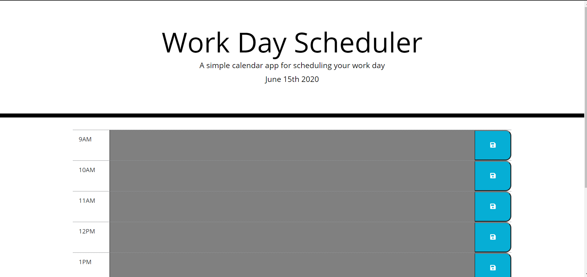
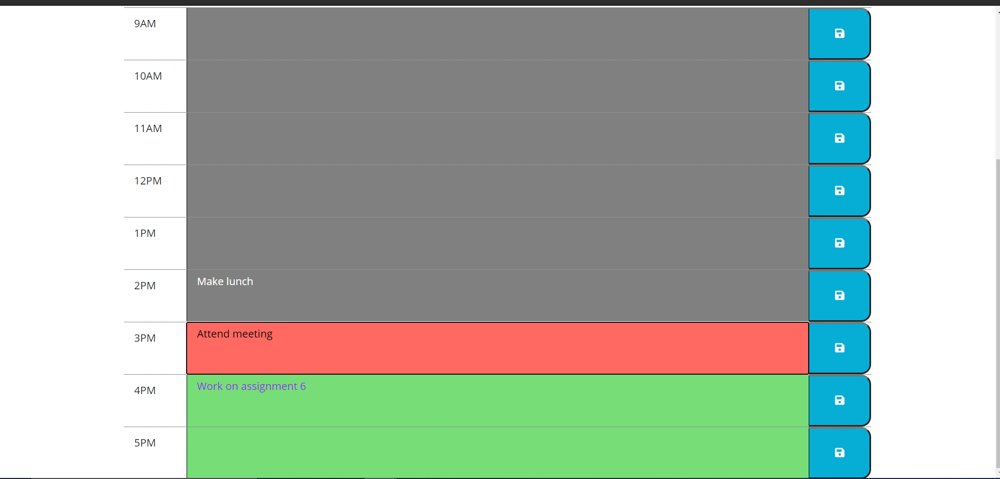
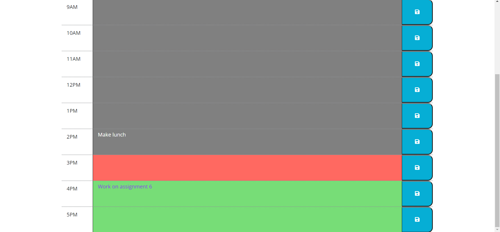

# Work Day Scheduler

Create a simple calendar application that allows the user to save events for each hour of the day. This app will run in the browser and feature dynamically updated HTML and CSS powered by jQuery.

## User Story

```
AS AN employee with a busy schedule
I WANT to add important events to a daily planner
SO THAT I can manage my time effectively
```

## About
 - The current work day is displayed at the top of the page
 - Timeblocks are for the standard 9am-5pm work day
 - Compared to the current time, each timeblock is colour coded with red for the present, green for the future and grey for the past
 - Clicking in the text area enables you to type an event, but that event isn't saved until the save button is clicked or enter key is hit
 - If the timeblock is grey and an event has been entered and saved, that event cannot be removed or changed until the next day

## Screenshots




## Link
https://mohammedyasirsuara.github.io/WorkDayPlanner/
